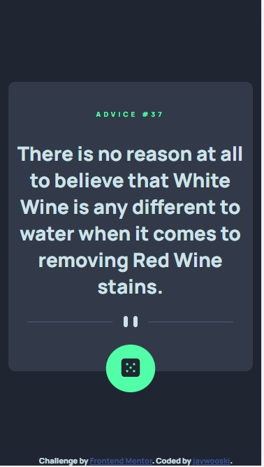

# Frontend Mentor - Advice generator app solution

This is a solution to the [Advice generator app challenge on Frontend Mentor](https://www.frontendmentor.io/challenges/advice-generator-app-QdUG-13db). Frontend Mentor challenges help you improve your coding skills by building realistic projects.

## Table of contents

- [Overview](#overview)
  - [The challenge](#the-challenge)
  - [Screenshot](#screenshot)
  - [Links](#links)
- [My process](#my-process)
  - [Built with](#built-with)
  - [What I learned](#what-i-learned)
  - [Useful resources](#useful-resources)
- [Author](#author)
- [Acknowledgments](#acknowledgments)

## Overview

### The challenge

Users should be able to:

- View the optimal layout for the app depending on their device's screen size
- See hover states for all interactive elements on the page
- Generate a new piece of advice by clicking the dice icon

### Screenshot

Here's a view of the app live.

### Links

- Solution URL: [Add solution URL here](https://your-solution-url.com)
- Live Site URL: [Live Site on GitHub](https://jaywooski.github.io/advice-generator-app-main/)

## My process

### Built with

- Semantic HTML5 markup
- CSS custom properties
- CSS Grid
- Mobile-first workflow
- [Advice Slip API](https://api.adviceslip.com) - API provider

### Useful resources

- [Web Dev Simplified - YouTube](https://www.youtube.com/watch?v=V_Kr9OSfDeU) - This helped me breakdown the use of using the async/await method (syntactic sugar) along with a try/catch method.
- [Mozilla Docs - Inner Text](https://developer.mozilla.org/en-US/docs/Web/API/HTMLElement/innerText) - This doc helped me search for what I wanted to manipulate in my html section. 
- [Mozilla Docs - fetch() method](https://developer.mozilla.org/en-US/docs/Web/API/fetch) - This doc can help you understand more about fetching data using the fetch method and what to expect when dealing with Promises.

## Author

- Website - [My Portfolio](https://www.jaywooski.site)
- Frontend Mentor - [@jaywooski](https://www.frontendmentor.io/profile/jaywooski)
- GitHub - [@jaywooski](https://www.github.com/jaywooski)

## Acknowledgments

Would love to give a big shout out to all developers who help just by expressing their expertise and knowledge on ways to code better. Clean code is always the way to go. You do not only get better at coding by just coding. Usually, you're learning from someone else. Thankful for everyone who responds on StackOverflow, posts on YouTube, and others who express easy to follow methods on their blog sites.   
